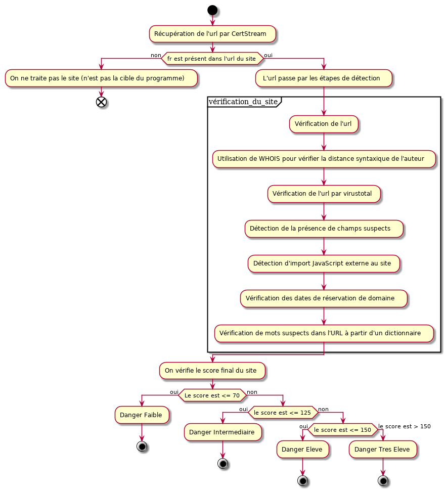

# Rapport TP Lutte Informatique Défensive

Par Gwendal Didot, Manon Derocles et Alexis Le Masle

## Principe du projet :
Il nous est demandé de créer un logiciel permettant de détecter si un site demandant une vérification de certificat est un site de phishing. Pour ce faire nous avons définis 20 points permettant de dire si un site est un site de phishing :

* Vérification de l'URL par rapport à une liste de site connus.
* Présence de script JavaScript malveillant
* Vérification de l'orthographe.
* Vérification que le site n'a pas utilisé Google Traduction pour passer c'est page en français
* Vérifier que le site ne réalise pas des vérification d’identification intempestive.
* Vérification de la date de réservation du nom de domaine du site.
* Comparer le protocole utilisé par rapport à une liste de référence.
* Vérifier si le site n'a pas une mauvaise configuration de son HTTPS.
* Vérification de la réputation de la CA.
* Vérifier si le site demande des données bancaires.
* Utilisation d'un antivirus pour vérifier le site.
* Comparer les fréquences de visites avec celles attendus pour la popularité du site.
* Vérifier la conformité à la RGPP du site.
* Détecter les redirection vers des sites proches (au niveau des URL)
* Distance syntaxique sur l’auteur (utilisation de WHOIS)
* Comparer l'hébergeur entre le site de phishing et le site qu'il copie.
* Géolocalisation de l'hébergeur en fonction de la localisation supposé du site.
* Réputation de l'adresse IP du site.
* Réputation de l'AS d'on provient le site.
* Comparer la distance réseau (utilisation de `traceroute`)

Notre programme se concentre exclusivement sur des site possédant `.fr` dans leur url.

Schéma du programme :

Bibliothèques à installer: 
apt install whois (Doit avoir le paquet "whois" de Linux d'installé) 
pip3 install bs4  
pip3 install certstream  
pip3 install whois  
pip3 install requests  
pip3 install stix2  
